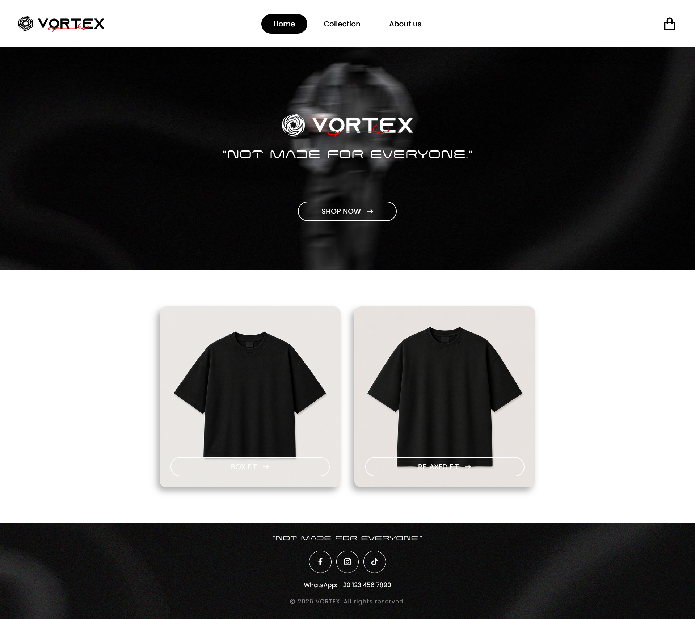

## VORTEX 🌀

VORTEX is a modern streetwear e-commerce platform built as my CS50 final project.

The project was created to combine fashion branding with a real-world web application experience — focusing on clean design, smooth user experience, and a minimal aesthetic inspired by modern streetwear brands.

Users can browse products, customize designs, manage their cart, and explore the brand through a fully responsive storefront built from scratch using Flask.

The project also includes Cloudinary media storage, Turso database integration, secure admin management, and production-ready deployment.

## Preview

## Project Repository

